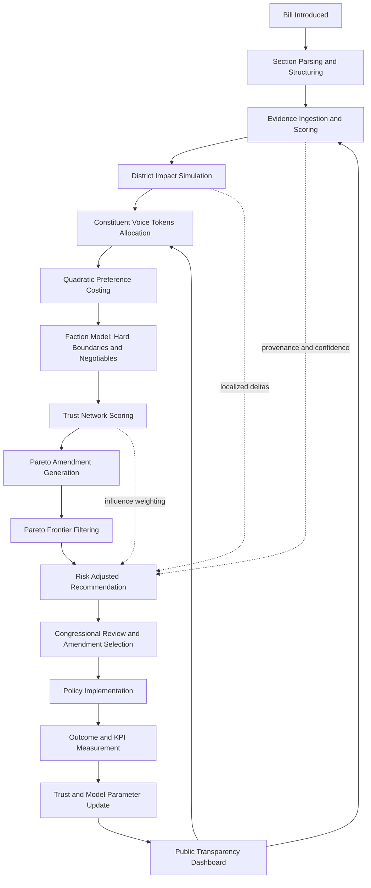
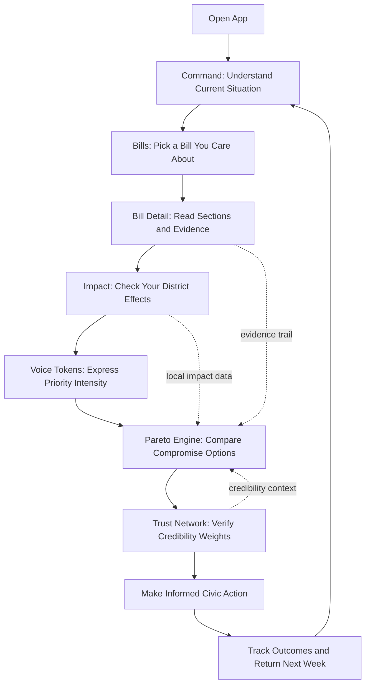

# Pareto Governance Engine

Pareto Governance Engine is a civic decision-support prototype that transforms legislative debate into a measurable, transparent, and explainable workflow.

The platform combines:
- Preference intensity modeling (quadratic voice-token feedback)
- Evidence-grounded policy interpretation
- District-localized impact simulation
- Trust-weighted participant scoring
- Pareto compromise recommendation for stalled bills

It is designed to show how democracy can move from zero-sum rhetoric toward structured, high-utility compromise.

## Table Of Contents

- Executive Summary For Judges And Investors
- 10-Minute Contributor Onboarding
- Product Vision
- What The App Does
- End-To-End User Flow
- Feature Modules
- Architecture
- Technology Stack
- Project Structure
- Local Development
- Scripts
- How To Extend The System
- Data Contracts And Domain Model
- Performance And UX Notes
- Documentation In This Repository
- Contribution Guidelines
- Current Scope And Limitations

## Executive Summary For Judges And Investors

### Problem
Democratic systems often fail at preference fidelity, evidence transparency, and compromise quality.

### Solution
Pareto Governance Engine turns legislative deliberation into a transparent optimization loop with:
- Intensity-aware constituent input (quadratic token budgeting)
- Evidence-linked and locally contextualized policy interpretation
- Trust-weighted participant influence
- Pareto-efficient compromise recommendation under hard constraints

### Why It Is Differentiated
- Captures preference intensity, not only preference direction
- Makes recommendation provenance inspectable
- Moves gridlock from rhetoric to measurable trade-off surfaces
- Preserves human decision authority while improving decision quality

### Demonstrated Product Surface
- Fully working multi-workspace application with:
	- command center
	- bill intelligence
	- token allocation
	- district impact simulation
	- compromise frontier exploration
	- trust network scoring

### Impact Thesis
If institutions can repeatedly choose higher-utility, constraint-respecting compromises with clear provenance, democratic legitimacy and policy quality can improve together.

## 10-Minute Contributor Onboarding

### 0. Prerequisites
- Node.js 20+
- npm 10+

## Deploying On Vercel

This repository is configured for Vercel static deployment with SPA route fallback.

### Why This Works
- Vercel builds the app with `npm run build`
- Output is served from `dist`
- Files in `dist` are served first
- Any unmatched route rewrites to `index.html` so client-side routes like `/bills`, `/impact`, and `/trust` do not 404

### Configuration Source
- `vercel.json`

### Recommended Vercel Project Settings
- Framework Preset: `Vite`
- Build Command: `npm run build`
- Output Directory: `dist`
- Install Command: `npm install`

No additional serverless functions are required for the current app.

### 1. Install and Run (2 minutes)

```bash
npm install
npm run dev
```

Open: http://127.0.0.1:5180

### 2. Learn The Product Surface (3 minutes)
- Navigate these pages in order:
	1. Command
	2. Bills
	3. Voice Tokens
	4. Impact
	5. Pareto Engine
	6. Trust Network

### 3. Learn The Code Surface (3 minutes)
- Start with these files:
	1. src/main.tsx
	2. src/services/governance-engine.ts
	3. src/domain/types.ts
	4. src/data/governance-data.ts
	5. src/components/ui.tsx

### 4. Make A Safe First Change (2 minutes)
- Add one field to a mock dataset in src/data/governance-data.ts.
- Thread it through types in src/domain/types.ts.
- Render it in one page card.
- Run:

```bash
npm run typecheck
npm run build
```

### New Contributor Rules Of Thumb
- Keep domain types explicit before UI changes.
- Keep computation in services, not JSX components.
- Prefer reusable primitives from src/components/ui.tsx.
- Preserve responsive behavior by using existing grid/card classes.

## Product Vision

Traditional legislative tools typically answer only: "support" or "oppose".

This project introduces a richer model:
- How strongly people care
- Why a conclusion is being recommended
- What district-level impact is expected
- Which compromises improve shared outcomes without violating non-negotiables

The core optimization framing is:

$$
\max_x \sum_i U_i(x) \quad \text{subject to} \quad C_j(x) \ge \text{threshold}_j
$$

Where:
- $U_i(x)$ is utility for stakeholder group $i$
- $C_j(x)$ represents hard constraints (fiscal, legal, or faction boundaries)

## What The App Does

The application provides six operational workspaces:

1. Command Center
- Real-time governance snapshot
- Current recommendation and trust overview

2. Bills Workspace
- Sortable and filterable bill corpus
- Drill-down into section-level bill intelligence

3. Voice Tokens Workspace
- Weekly budgeted quadratic preference allocation
- Faction boundaries and negotiable zones

4. Impact Workspace
- Localized district impact estimates per bill section
- Evidence-linked explanations and confidence context

5. Pareto Engine Workspace
- Amendment scoring
- Pareto frontier identification
- Risk-adjusted compromise recommendation

6. Trust Network Workspace
- Credibility profiles based on accuracy, expertise, consistency, and transparency

## End-To-End User Flow

1. Select a bill from the corpus.
2. Review section-level summaries with visible evidence provenance.
3. Simulate district-specific impact deltas.
4. Allocate voice tokens to express preference intensity.
5. Compare compromise options from Pareto frontier results.
6. Inspect trust-weighted influence signals.
7. Take informed civic action and revisit as outcomes evolve.

For full narrative and diagrammed flow, see:
- docs/end-to-end-workflow.md
- docs/citizen-journey.md

## System Workflow Diagram



## Citizen Journey Diagram



## Feature Modules

### Quadratic Constituent Feedback
- Voice allocations are constrained by a weekly token budget.
- Cost function:

$$
	ext{cost} = (\text{votes})^2
$$

- This reveals intensity while discouraging low-cost flooding.

### Evidence And Policy Intelligence
- Bill evidence can include text, census inputs, budget models, expert analysis, and public comments.
- Evidence cards include trust and recency indicators.

### Localized Impact Mapping
- Section impact estimation adapts to district profile factors such as rural share, small business density, and income normalization.

### Trust Network Scoring
- Participant trust score blends:
  - Accuracy
  - Expertise
  - Consistency
  - Transparency

### Pareto Compromise Engine
- Candidate amendments are scored by:
  - Total utility
  - Minimum faction utility
  - Risk-adjusted score
- Non-dominated points form the Pareto frontier.

## Architecture

The codebase uses a modular, replaceable design:

- UI layer: React + route-based workspaces
- Domain layer: typed contracts for bills, districts, factions, trust participants, evidence, impacts, amendments
- Service layer: deterministic computation and mock async data access
- Data layer: local mock datasets with stable interfaces

This keeps implementation plug-and-play:
- Replace data providers without changing component contracts
- Keep domain contracts stable while iterating on algorithms
- Add new pages using shared UI primitives and grid system

## Technology Stack

- React 19
- TypeScript
- Vite
- TanStack Router
- TanStack Query
- TanStack Table
- TanStack Virtual
- TanStack Form (included for future production forms)
- Lucide React

## Project Structure

```text
src/
	components/
		AppShell.tsx        # Navigation shell and responsive layout container
		BillTable.tsx       # Table workspace for bills
		EvidenceList.tsx    # Virtualized evidence list
		ui.tsx              # Reusable UI primitives (Card, Badge, Meter, etc.)
	data/
		governance-data.ts  # Mock datasets for bills, factions, trust, scenario data
	domain/
		types.ts            # Domain contracts and shared types
	services/
		governance-engine.ts # Core calculations, impact logic, trust scoring, Pareto scoring
	main.tsx              # Route definitions and all page workspaces
	styles.css            # Global style system and responsive breakpoints
```

## Local Development

Prerequisites:
- Node.js 20+
- npm 10+

Install dependencies:

```bash
npm install
```

Start development server:

```bash
npm run dev
```

Application URL:
- http://127.0.0.1:5180

## Scripts

```bash
npm run dev        # Start local development server
npm run build      # Type-check and produce production build
npm run preview    # Preview production build locally
npm run typecheck  # Run TypeScript checks
```

## How To Extend The System

### Replace Mock Data With Live APIs

You can incrementally swap the mock service layer:
- Replace listBills() with legislative API integrations.
- Replace getLocalizedImpacts() with calibrated econometric or census pipelines.
- Replace evidence datasets with retrieval results from a production RAG service.
- Replace static amendment scenarios with generated multi-agent negotiation outputs.

### Add A New Workspace Page

1. Create a page component in main.tsx (or extract into a dedicated file).
2. Register a new route with TanStack Router.
3. Add navigation entry in AppShell.
4. Use shared primitives in components/ui.tsx for visual consistency.
5. Reuse grid and card classes from styles.css for responsive behavior.

### Keep It Generic

When introducing new logic:
- Add domain types first in src/domain/types.ts.
- Keep service functions pure and deterministic where possible.
- Keep UI components presentation-focused and data-agnostic.

## Data Contracts And Domain Model

Key model groups:
- Legislative artifacts: Bill, BillSection
- Geography and context: District
- Participation and preference: VoiceAllocation, Faction
- Evidence and trust: EvidenceSource, TrustParticipant
- Optimization: CompromiseAmendment, ParetoScenario, ParetoPoint

These contracts make integrations predictable and reduce coupling between UI and data source.

## Performance And UX Notes

- Evidence list is virtualized for scalability.
- Query caching and stale-time defaults reduce unnecessary reloads.
- Responsive shell and grid behavior support desktop, tablet, and mobile use.
- Dense operations-first layout is intentional for civic analysis workflows.

## Documentation In This Repository

- docs/requirements-traceability.md
- docs/congressional_app.txt
- docs/end-to-end-workflow.md
- docs/citizen-journey.md

## Contribution Guidelines

Recommended workflow:

1. Create a focused branch.
2. Keep changes small and bounded by module.
3. Run type-check and build locally before pushing.
4. Update docs when behavior or architecture changes.

Quality checklist before merge:
- Type safety preserved
- Responsive behavior verified
- New behavior documented
- No hard-coded data assumptions in reusable components

## Current Scope And Limitations

- This is a prototype with mock datasets, not a production legislative authority.
- Impact estimates are illustrative and do not claim real-world forecasting accuracy.
- Trust and compromise outputs are decision-support signals, not final policy decisions.

The repository is intentionally structured so production services can replace mock components without a full rewrite.
