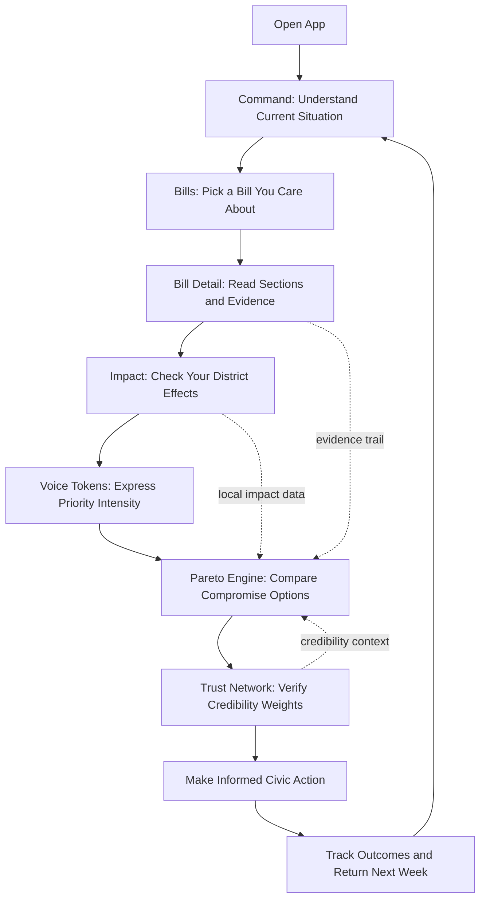

# Citizen Journey Guide (Simple, Step-by-Step)

This document explains the full citizen experience in plain language.
If you are not technical, you can still follow this from start to finish.

## What This App Does In One Sentence

It helps people understand bills, show what matters most to them, and see fair compromise options backed by evidence.

## Why This Matters To You

Most civic tools only ask, "Do you support this?"
This tool also asks, "How strongly do you care?" and "What evidence supports the decision?"

That means:
- Your priorities are clearer.
- Minority needs can be seen when intensity is high.
- You can see why a recommendation is made, not just the final answer.

## 2-Minute Quick Start

1. Open Command page
- See the current snapshot of bills, trust, and recommended compromise.

2. Go to Bills
- Pick a bill you care about.

3. Open Bill details
- Read section summaries in plain language.
- Check evidence sources next to those summaries.

4. Go to Impact
- Choose your district and view local effects.

5. Go to Voice Tokens
- Allocate your weekly tokens to issues that matter most.

6. Go to Pareto Engine
- Review compromise options and the recommended amendment.

7. Go to Trust Network
- Understand which sources and participants were weighted more heavily and why.

## Screen-By-Screen Citizen Journey

### Step 1: Command (Big Picture)

What you do:
- Start here to see the system status.

What you learn:
- Number of active bills.
- Current trust score average.
- Best current compromise score.

Why it helps:
- You instantly know where public attention and decision pressure are highest.

### Step 2: Bills (Choose Your Topic)

What you do:
- Search and filter the list.
- Open a bill by ID/title.

What you learn:
- Sponsor, domain, status, and number of sections.

Why it helps:
- You do not waste time scanning unrelated legislation.

### Step 3: Bill Detail (Understand The Bill)

What you do:
- Read section-level summaries.
- Check evidence cards (bill text, census, budget models, expert/public input).

What you learn:
- What each section changes.
- Which groups are likely affected.
- Confidence level of the interpretation.

Why it helps:
- You are not forced to trust a slogan. You can inspect the source trail.

### Step 4: Impact (What Happens In Your District)

What you do:
- Select your district.
- View localized projections by bill section.

What you learn:
- Estimated local exposure/benefit.
- Confidence and explanation for each estimate.

Why it helps:
- Policy becomes local and personal, not abstract.

### Step 5: Voice Tokens (Show Priority Intensity)

What you do:
- Spend a weekly budget of tokens across issues.

Key rule:
- Cost = votes squared.

Simple example:
- 1 vote costs 1 token.
- 2 votes cost 4 tokens.
- 3 votes cost 9 tokens.

Why this is fairer:
- You can strongly back what truly matters to you.
- But no one can cheaply overwhelm everything else.

### Step 6: Pareto Engine (Find Better Compromises)

What you do:
- Review amendment options.
- Compare total utility, minimum faction utility, and risk-adjusted score.

What you learn:
- Which options improve outcomes without violating core non-negotiables.

Why it helps:
- It replaces all-or-nothing deadlock with measurable trade-offs.

### Step 7: Trust Network (See Influence Transparency)

What you do:
- Inspect trust dimensions: accuracy, expertise, consistency, transparency.

What you learn:
- Why certain participants/sources carry more influence in recommendations.

Why it helps:
- Reduces misinformation impact and increases decision legitimacy.

## Citizen Journey Diagram

## What "Informed Civic Action" Means

After reviewing a bill, you can:
- Contact your representative with specific section-level feedback.
- Join a local deliberation panel with evidence-backed points.
- Reallocate next week tokens based on updated information.
- Track whether promises matched real outcomes.

## A Simple Weekly Routine (10 Minutes)

1. 2 minutes: Check Command and choose one active bill.
2. 3 minutes: Read bill sections and evidence highlights.
3. 2 minutes: Review district impact.
4. 2 minutes: Allocate tokens based on your priorities.
5. 1 minute: Check compromise recommendation and trust indicators.

## How This Makes Democracy Better For Ordinary People

1. Easier to understand
- Policy is broken into clear sections with plain explanations.

2. More representative
- Strong needs are visible through intensity-based feedback.

3. More transparent
- Recommendations are tied to sources and trust scores.

4. Less polarized
- The system searches for practical compromises instead of winner-take-all fights.

5. More accountable
- Outcomes are tracked and compared to predictions over time.

## If You Are New To Policy

Start with this sequence only:
- Bills -> Bill Detail -> Impact -> Voice Tokens

You do not need to master every metric on day one.
Focus first on understanding one bill that affects your area.
