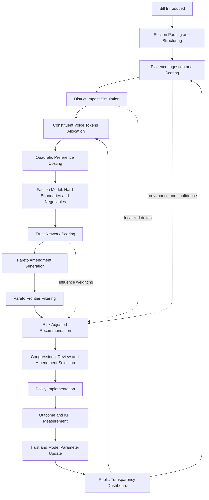

# End-to-End Workflow: Pareto Governance Engine

This workflow is synthesized from the docs and implemented code paths:
- `docs/congressional_app.txt`
- `docs/requirements-traceability.md`
- `docs/Judging_Pitch_Aarti_Ravikumar.pptx` (slide text extraction)
- `src/services/governance-engine.ts`
- `src/domain/types.ts`
- `src/data/governance-data.ts`

## System Objective

Shift governance from binary political conflict to a measurable optimization process that maximizes total civic utility while respecting hard constraints and rights.

Formal framing used by the proposal:

$$
\max_x \sum_i U_i(x) \quad \text{subject to} \quad C_j(x) \ge \text{threshold}_j
$$

Where:
- $U_i(x)$ is stakeholder utility from policy configuration $x$.
- $C_j(x)$ captures legal, fiscal, ethical, and faction hard-boundary constraints.

## End-to-End Operational Workflow

1. Bill Intake And Structuring
- New bill text and section metadata are ingested.
- Bill sections are normalized into domain-level units (tax, health, infrastructure, civil-rights, etc.).
- Evidence links are attached to each bill and section.

2. Evidence Memory And Quality Layer
- Source types are indexed (bill text, census, budget, expert, public comment).
- Each source gets trust and recency scores.
- Evidence is exposed in explainable cards so users can inspect provenance.

3. District-Level Impact Simulation
- For each bill section, localized impact is estimated per district.
- The engine adjusts estimates by demographic and economic context (for example, rural share, small-business density, income normalization).
- Output includes confidence and explanation fields for every projected impact.

4. Constituent Preference Capture With Intensity
- Constituents get a scarce weekly voice-token budget.
- Preferences are expressed with quadratic voting costs:
  - Cost = votes squared
- This prevents cheap vote flooding and surfaces true preference intensity.

5. Faction Constraint Modeling
- Faction inputs are encoded as:
  - hard boundaries (non-negotiables)
  - negotiable zones
  - issue-level priority weights
- This creates explicit constraints before compromise search begins.

6. Trust-Network Weighting
- Participants are scored for accuracy, expertise, consistency, and transparency.
- Trust score affects influence weighting and recommendation confidence.
- This decreases the effect of low-credibility inputs while preserving broad participation.

7. Pareto Compromise Search
- Candidate amendments are generated and scored for:
  - average utility
  - minimum faction utility
  - risk-adjusted score
- Pareto frontier filtering keeps options that are non-dominated.
- Best compromise recommendation is selected from frontier points.

8. Legislative Decision Support
- Congressional staff and constituents see:
  - recommended amendment
  - trade-offs by faction
  - impact deltas by district
  - evidence citations and trust context
- Human actors decide, but with transparent, comparable alternatives.

9. Post-Decision Outcome Tracking
- Real-world outcomes are measured against predictions.
- Forecast error and implementation data feed a trust update loop.
- Model assumptions and weights are recalibrated over time.

10. Public Transparency And Learning Loop
- Public dashboards show what changed, why it was recommended, and what actually happened.
- This closes the accountability cycle and improves future decisions.

## Workflow Diagram

## How This Makes Democracy Better

1. Captures Intensity, Not Just Direction
- Majority voting captures only yes/no direction.
- Quadratic costs force prioritization, so high-stakes minority needs are visible without letting any group dominate cheaply.

2. Reduces Polarization Through Structured Trade-Offs
- Hard boundaries and negotiables are explicitly modeled.
- Negotiation moves from rhetorical conflict to constrained optimization over amendable parameters.

3. Improves Evidence Quality And Resist Misinformation
- Recommendations are traceable to scored evidence sources.
- Low-credibility or stale inputs have less influence than verified, recent evidence.

4. Increases Legitimacy Through Explainability
- Every recommendation is auditable: what data was used, what utility changed, what risks were accepted.
- Constituents can inspect the same logic staff sees.

5. Aligns Incentives Toward High Utility Outcomes
- Representatives are rewarded for achieving measurable district impact and cross-faction gains, not just partisan wins.

6. Creates A Self-Correcting Civic System
- Trust and forecasting are updated from outcome-vs-prediction performance.
- The governance process learns over time instead of repeating static political scripts.

## Suggested KPIs For Production Evaluation

- Participation quality:
  - share of users submitting intensity-weighted preferences
  - budget overrun rate in token allocations
- Deliberation quality:
  - number of non-dominated compromise options per stalled bill
  - median minimum-faction utility of adopted amendments
- Outcome quality:
  - prediction error between simulated and realized district impacts
  - improvement in district-level service or economic indicators post-policy
- Trust quality:
  - change in average participant trust score over time
  - ratio of high-trust vs low-trust evidence in final decisions
- Democratic legitimacy:
  - constituent perceived fairness score
  - cross-faction acceptance rate of final package
